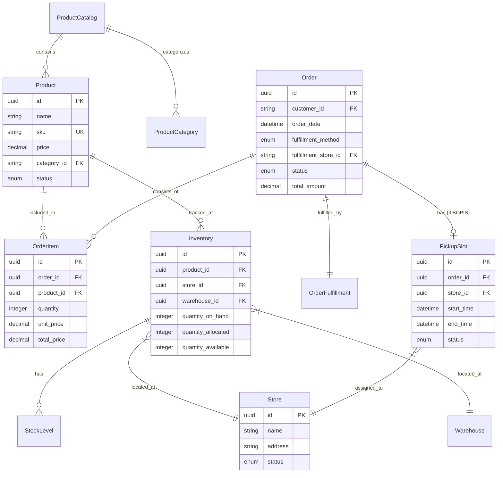
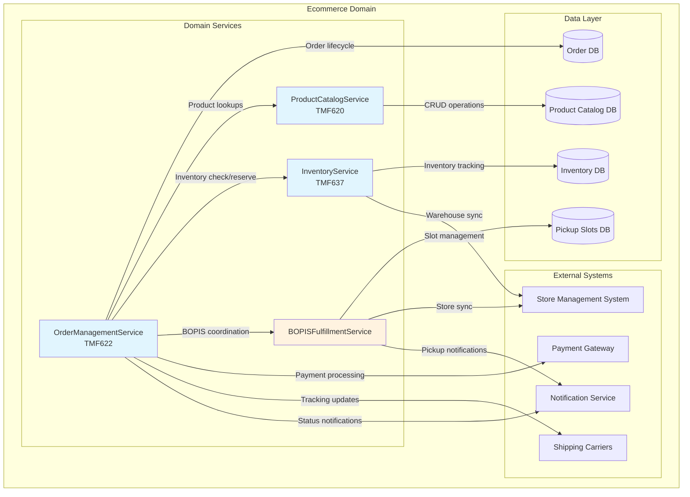
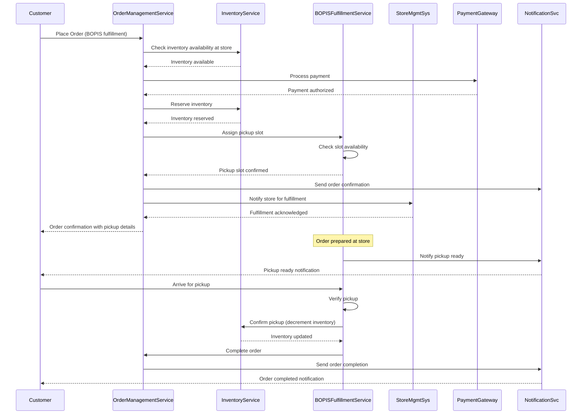
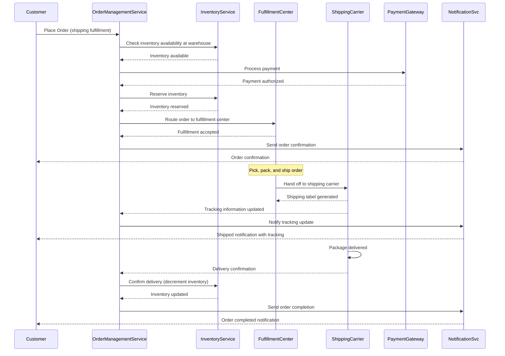

# Domain Architecture: Ecommerce

## Context Evidence

- **Workspace**: ecommerce-domain
- **Domain**: ecommerce
- **Domain profile**: generic
- **SA baseline**: Direct domain initialization (no SA handoff)
- **Tools used**: domain-architecture skill
- **Generated**: 2026-03-22T22:47:00Z

## Domain Boundary

**Bounded context**: E-commerce domain covering online shopping, catalog management, order processing, and fulfillment capabilities including BOPIS (Buy Online, Pick Up In Store).

**Ubiquitous language**:
| Term | Definition |
|---|---|
| Product | An item available for purchase in the catalog |
| Order | A customer's request to purchase one or more products |
| Fulfillment | The process of preparing and delivering an order to the customer |
| BOPIS | Buy Online, Pick Up In Store - a fulfillment method where customers place orders online and collect them at a physical store |
| Inventory | Real-time stock levels across physical stores and warehouses |
| Pickup Slot | A reserved time window for BOPIS order collection |
| Store Location | Physical retail site where BOPIS orders are collected |

**Anti-corruption layers**:
- Inventory adapter to store management systems
- Payment gateway integration layer
- Shipping carrier adapter for non-BOPIS fulfillment

## Domain Model

### Core Aggregates

**Product Catalog Aggregate**
- Root: ProductCatalog
- Entities: Product, ProductCategory, ProductVariant
- Value Objects: Price, SKU, ProductAttributes

**Order Aggregate**
- Root: Order
- Entities: OrderItem, OrderFulfillment
- Value Objects: OrderStatus, PaymentDetails, FulfillmentMethod

**Inventory Aggregate**
- Root: Inventory
- Entities: StockLevel, InventoryReservation
- Value Objects: Location, StockStatus

**BOPIS Aggregate**
- Root: PickupSlot
- Entities: PickupReservation, StoreFulfillment
- Value Objects: PickupStatus, TimeWindow

### Key Relationships

- Product (1..*) → OrderItem
- Order (1..*) → OrderItem
- Order (1) → OrderFulfillment
- Inventory (1..*) → StockLevel per Location
- Order (1) → PickupSlot (if BOPIS)
- PickupSlot (1) → Store Location

### Domain Model Diagram

## Component Landscape

## Workflows

### BOPIS Order Fulfillment Workflow

### Standard Order Fulfillment Workflow

## Interface Implementations

### Internal Domain Services
- ProductCatalogService: Product discovery and category navigation
- OrderManagementService: Order lifecycle management
- InventoryService: Real-time inventory tracking and reservations
- BOPISManagementService: Pickup slot management and store coordination
- PaymentProcessingService: Payment authorization and capture

### External Integrations
- Store Management System: Store inventory synchronization
- Payment Gateway: Payment processing
- Shipping Carriers: Non-BOPIS fulfillment tracking
- Customer Notification Service: Order status updates

## TMF Alignment

**Covered APIs**:
- TMF620 (Product Catalog Management): Product catalog operations
- TMF622 (Product Ordering): Order lifecycle management
- TMF645 (Party Role Management): Customer profile management

**Uncovered APIs**:
- TMF637 (Service Ordering): Not applicable to pure product ordering
- TMF638 (Service Catalog): Service-specific catalog features

**SID Mappings**:
- Product → ProductSpecification
- Order → ProductOrder
- OrderItem → ProductOrderItem
- StockLevel → Resource / ProductOffering
- PickupSlot → ProductOffering (time-based fulfillment)

## Compliance

- PCI DSS: Payment processing compliance through certified payment gateway
- GDPR: Customer data privacy and consent management
- Accessibility: WCAG 2.1 AA compliance for customer interfaces
- Regional regulations: Location-specific fulfillment and tax compliance

## SA Conformance Report

- **NFR budget fit**: Direct domain initialization (NFRs defined within)
- **Interface conformance**: Domain-internal interfaces defined
- **Pattern conformance**: Domain-driven design patterns applied
- **Issues**: None identified

## Decisions

| ID | Decision | SA Deviation? | Review Required? |
|---|---|---|---|
| DA-001 | BOPIS implementation requires real-time store inventory integration | No | No |
| DA-002 | Payment processing delegated to certified third-party gateway | No | No |
| DA-003 | Separate aggregate for BOPIS to handle pickup slot complexity | No | Yes |

## Open Questions

- Integration points with store management systems specification
- Detailed pickup slot capacity management rules
- Multi-store inventory allocation strategy for split BOPIS orders
- Customer notification preferences and channel routing
- Returns and exchanges process for BOPIS orders